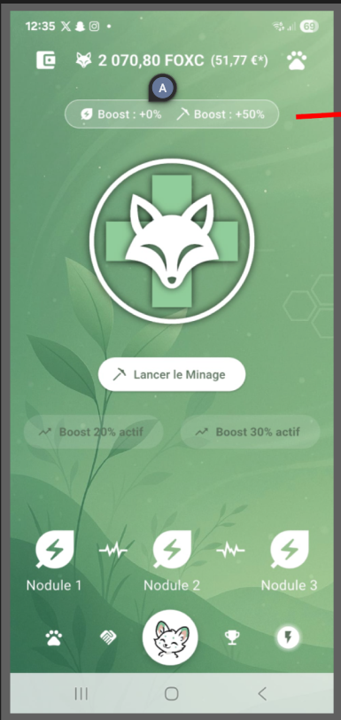
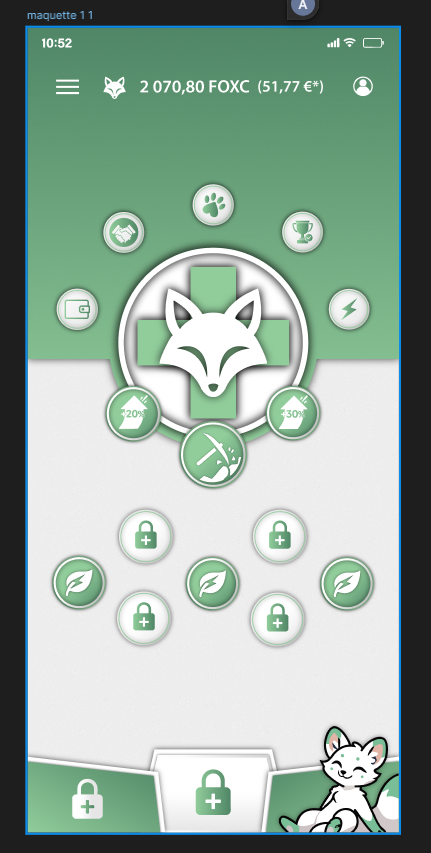
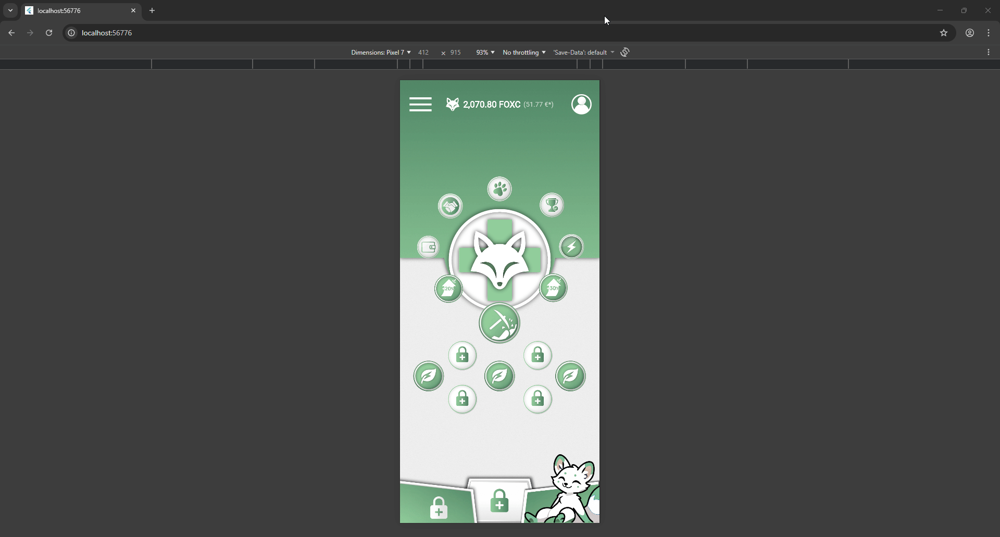

# Flutter Mining Screen Redesign

A responsive Flutter implementation of a redesigned mining screen based on Figma specifications.

## 📱 Screenshots

### Before (Original Design)


### After (Redesigned)


### Responsive Behavior


## 🎯 Project Overview

This project implements a complete redesign of a mining screen for a cryptocurrency application, featuring:
- Clean, modular widget composition
- Responsive layout for all screen sizes
- Scalable typography with accessibility support
- Optimized asset management

## 🚀 Getting Started

### Prerequisites
- Flutter SDK (3.0 or higher)
- Dart SDK (3.0 or higher)
- Android Studio / VS Code with Flutter extensions
- iOS Simulator / Android Emulator

### Installation

1. **Clone the repository**
   ```bash
   git clone https://github.com/yourusername/your-repo-name.git
   cd your-repo-name
   ```

2. **Install dependencies**
   ```bash
   flutter pub get
   ```

3. **Run the app**
   ```bash
   flutter run
   ```

## 📐 Architecture & Design Decisions

### Widget Composition
The screen is broken down into smaller, reusable components:
- **HeaderBar**: AppBar with logo, coin balance, and notifications
- **BackgroundCanvas**: Background layers and gradients
- **BoostArea**: Circular boost icons positioned around the fox
- **CentralFoxArea**: Main fox logo with layered backgrounds
- **PickaxeWidget**: Interactive pickaxe element
- **LeavesRow**: Three leaf elements in a row
- **LocksGrid**: Four lock icons in a grid layout
- **BottomSection**: Bot characters with shadows and cat

### Responsiveness Strategy
1. **LayoutBuilder**: Switches between compact (<600px) and wide (≥600px) layouts
2. **Flexible & Expanded**: Used to distribute space proportionally
3. **Responsive Scaling**: 
   - Base width: 430px (iPhone 14 Pro Max)
   - Content scale: clamped between 0.7x - 2.0x
   - Icon scale: clamped between 0.8x - 1.5x
4. **Typography Scaling**: Uses `MediaQuery.textScaleFactorOf(context)` for accessibility
5. **Relative Sizing**: All dimensions calculated relative to screen width

### Code Structure
```
lib/
├── screens/
│   └── mining_screen_layout.dart  # Main screen with all components
└── widgets/                       # (Future modularization)
```

## 🎨 Assets

All assets are organized in the `asset/` directory:
- `appbar_icons/` - Header icons
- `background/` - Background images
- `centre/` - Central fox logo layers
- Game elements: paws, handshake, prize_cup, wallet, power, boost icons
- Character elements: Bot, Bott, Bottt, Cat with shadows
- Leaf and Lock icons

## 📱 Supported Screen Sizes

- **Mobile (Compact)**: < 600px width
  - Optimized for phones (iPhone, Android devices)
  - Single-column layout with centered elements
  
- **Tablet (Wide)**: ≥ 600px width
  - Currently mirrors compact layout
  - Ready for future multi-column implementation

## 🔧 Technical Highlights

1. **Scalable Typography**: Text sizes adjust based on user's accessibility settings
2. **Performance**: Efficient asset loading with proper caching
3. **Maintainability**: Small, focused widgets with single responsibilities
4. **Type Safety**: Full Dart type safety with null safety enabled

## 📝 Major Changes from Original

1. **Refactored monolithic build method** into 12+ smaller widgets
2. **Added responsive typography scaling** using MediaQuery
3. **Implemented layout mode switching** (compact vs wide)
4. **Created reusable components** (BotWithShadow, responsive helpers)
5. **Improved code organization** with clear separation of concerns
6. **Enhanced maintainability** - each UI section is now independently modifiable

## 🐛 Known Issues

None currently! 🎉

## 🔮 Future Enhancements

- [ ] Add animations to boost icons and pickaxe
- [ ] Implement actual wide/tablet layout variant
- [ ] Add tap interactions for all game elements
- [ ] Integrate with state management (Provider/Riverpod)
- [ ] Add sound effects for interactions
- [ ] Implement level progression logic


## 👤 Author

**Your Name**
- GitHub: [@Shashank's_Inn](https://github.com/GEEGEEGOOGOO)
- Email: shashank181002@gmail.com

## 🙏 Acknowledgments

- Original design provided via Figma
- Icons and assets from project specifications
- Flutter community for best practices and patterns

---

**Built with ❤️ using Flutter**